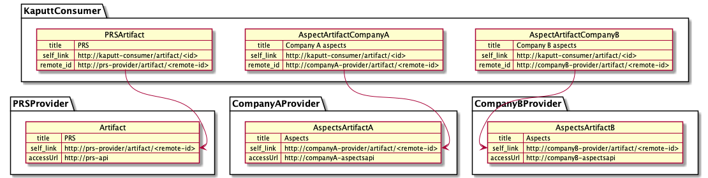

# Consume aspects

This document explains how aspects will be consumed by Kaputt in the Speedboat environment.

## Problem statement

If company A wants to share an artifact with other companies, company A has to register the artifact once in the company-A-provider-connector.
Then, each company needs to request an agreement between their own consumer and the company A provider. Each of them would get a URL to access the artifact. The URL point to their own consumer.
If company B wants to access the artifact from company A, it will use the following URL: company-b-consumer/artifacts/123/data, company C would use: company-c-consumer/artifacts/456/data.
This makes it impossible to provide a common URL to access a specific artifact. Each of the company needs to negotiate a contract and generate their own url to access the artifact.

This document provides a temporary solution that work with Kaputt as the only aspect consumer.

## Consume aspects design

If Kaputt service wants to consume the aspects from company A and company B.
Company A needs to create an "Aspect Artifact A" inside its Company A connector. The "Aspect Artifact A" contains an `accessUrl` pointing to an aspect API provided by company A.
Company B needs to create an "Aspect Artifact B" inside its Company B connector. The "Aspect Artifact B" contains an `accessUrl` pointing to an aspect API provided by company B. 
Kaputt needs to create an agreement between its Kaputt-consumer-connector and Company-A-connector, and a second agreement with Company-B-connector.
This means that Kaputt consumer will contain: 
- One artifact to access Aspect Artifacts from company A
- One artifact to access Aspect Artifacts from company B
- One artifact to access PRS API

If Kaputt needs to consume aspects from Company-A, it will need to query its own consumer with the right artifact-id.
But, PRS is the service that provides artifact URLs to Kaputt.

This is why we propose the following temporary solution:
PRS will be aware of the existing artifacts in the Kaputt consumer. It will provide the correct prefix URL depending on the oneIDManufacturer.

