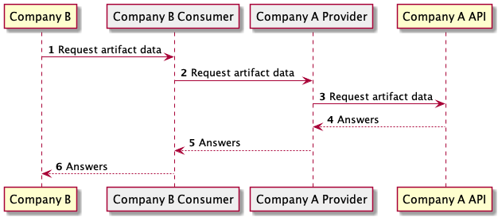
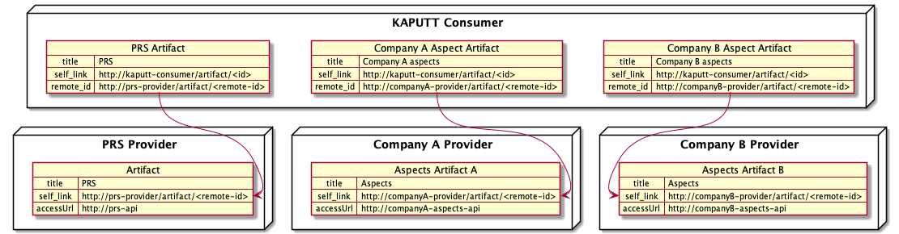
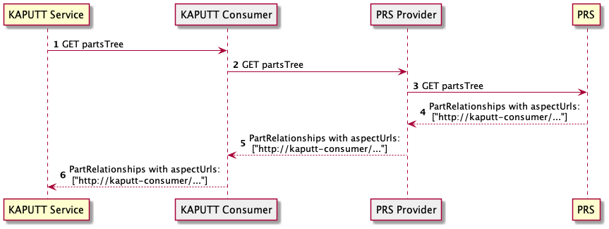
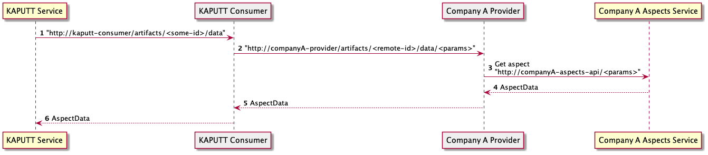

# Consume aspects

This document explains how KAPUTT GmbH will consume aspects in Speedboat.
It is a temporary setup as it can work if there is only one entity consuming artifacts.

## Problem statement

If company A wants to share an artifact with other companies, company A has to create an artifact in the company-A-provider-connector.
Then, each company needs to have an agreement between their consumer and the company A provider.
Each consumer stores an internal URL to access the artifact.

This diagram explains how Company B can consume data from Company A through connectors:

We can see that CompanyB calls the CompanyB consumer to access CompanyA's data.
Each company needs to use its own consumer to query the artifact from Company A.
It means that if company B wants to access the artifact from company A, it will use the following URL: `http://company-b-consumer/artifacts/123/data` when company C would use: `http://company-c-consumer/artifacts/456/data`.
This fact makes it impossible to provide a common URL to access a specific artifact. Each company needs to negotiate a contract and generate its own URL to access the artifact.

This document provides a temporary solution to this problem. The solution would be implemented on the PRS service side.

## Consume aspects design

### Artifacts creation

If Kaputt service wants to consume the aspects from company A and company B:
Company A needs to create an "Aspect Artifact A" inside its Company A connector. The "Aspect Artifact A" contains an `accessUrl` pointing to an aspect API provided by company A.
Company B needs to create an "Aspect Artifact B" inside its Company B connector. The "Aspect Artifact B" contains an `accessUrl` pointing to an aspect API provided by company B.
Kaputt needs to create an agreement between its Kaputt-consumer-connector and Company-A-provider-connector, and a second agreement with Company-B-provider-connector.
This means that Kaputt consumer will contain:

- One artifact to access Aspect Artifacts from company A
- One artifact to access Aspect Artifacts from company B
- One artifact to access PRS API

If Kaputt needs to consume aspects from Company-A, it will need to query its own consumer with the right artifact-id.
But, PRS is the service that provides artifact URLs to Kaputt.

This is why we propose the following temporary solution:
PRS will be aware of the existing artifacts in the Kaputt consumer. It will provide the correct prefix URL depending on the oneIDManufacturer.

### Sequence diagram

The following sequence diagram explains how the Kaputt service can obtain the correct URL to query aspects.
CompanyA could be a company like BMW or ZF that provides aspects.

It is important to note that PRS will provide the correct URL depending on the oneIDManufacturer.
Kaputt will have one artifact registered per manufacturer. PRS will know these artifacts and provide the correct one to Kaputt.
Kaputt will obtain a URL on Kaputt-consumer side, like this `http://kaputt-consumer/artifacts/UUID/data/<params>`
It will need to use this URL to request the aspects.

The following sequence diagram explains how the Kaputt service can obtain the artifact data after getting the artifact URL from PRS.

### A potential future solution

A potential future solution working with several aspects consumer would be:

- PRS provides the URL of the artifact on the provider side.
- Kaputt tries to retrieve the corresponding artifact in its consumer. If the artifact does not exist, it negotiates a contract to obtain an agreement and create an artifact in its consumer.

For now, we will not put effort into this solution.
